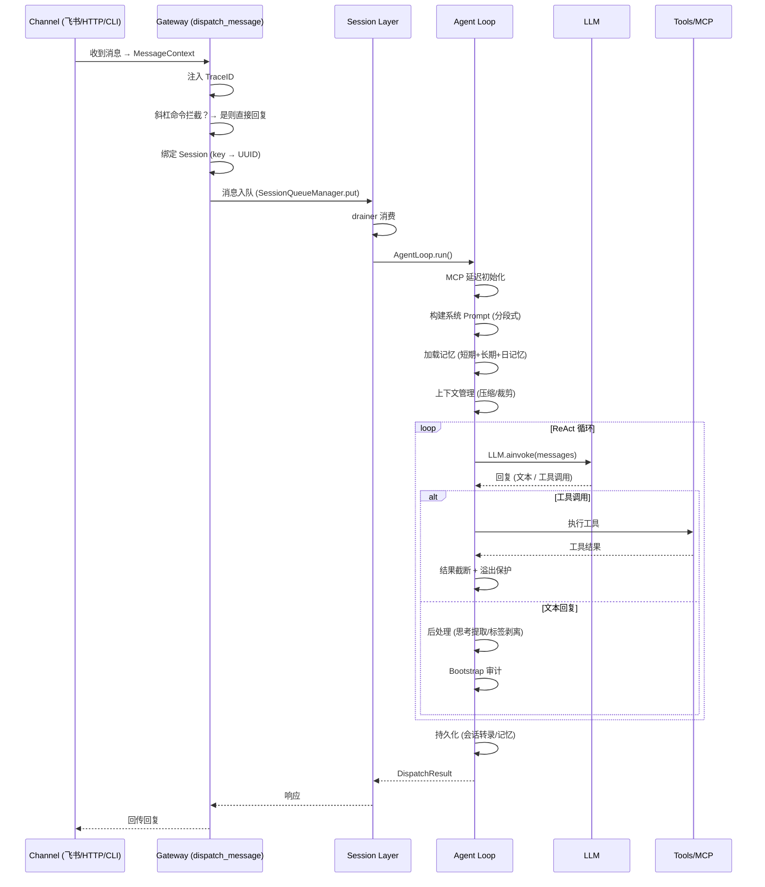

<p align="center">
  <h1 align="center">Aion</h1>
  <p align="center">个人多 Agent 助手 — Multi-Agent · Memory · MCP · Skills</p>
</p>

<div align="center">


[](https://www.apple.com/macos)
[](https://www.deepseek.com)
[](https://www.feishu.cn)
[](https://modelcontextprotocol.io)
[](docs/tools.md)


</div>

<p align="center"><em>by Jimmy Zhang</em></p>

面向个人的多 Agent AI 助手：**多工作空间 → 多 Agent 协作 → 层次化记忆 → 工具生态**。  
作者目前基于 macOS、DeepSeek/Ali Maas、飞书 使用，其它环境未涉及。

> [!NOTE]
> **项目已封板，不再新增功能。** 现有功能正在逐步迁移至 **DeepSeek-Harness（dsh）**，本仓库仅保留用于历史参考和必要的兼容性维护。

---

## 📖 介绍

aion 是一个以 **个人助手** 为定位的多 Agent 系统，核心设计理念：

- **多工作空间** — 隔离不同场景（工作/生活/项目），每个工作空间拥有独立的 Agent、记忆、技能和配置
- **多 Agent 协作** — Leader + Member + Subagent 三级协作模型，临时一次性subagent / 预设有独立人格独立记忆的subagent
- **层次化记忆** — 会话级短期记忆、日级中期记忆、持久化长期记忆 + Chroma 向量 + FTS5 关键词双通道检索
- **插件化 Channel** — 飞书、HTTP、CLI 等多入口统一接入 `dispatch_message()` 调度
- **丰富工具生态** — 20+ 内置工具（文件、搜索、执行、记忆、网络）+ 可插拔 Skills + MCP 协议支持
- **全链路可观测** — Langfuse Trace 贯穿所有 Agent 调用、工具执行和子 Agent 派生

## 📦 安装与部署

### 环境依赖

| 依赖 | 要求 |
|------|------|
| Python | ≥ 3.10 |
| 操作系统 | macOS（主要开发平台）、Linux、Windows（实验性） |

**各平台系统依赖：**

```bash
# macOS（Homebrew Python）
/opt/homebrew/bin/python3 -m venv .venv

# Linux（系统 Python）
python3 -m venv .venv

# Windows（PowerShell）
python -m venv .venv
```

### 从源码安装

```bash
# 1. 克隆仓库
git clone https://github.com/aaron3323/aion.git
cd aion

# 2. 创建虚拟环境（Python ≥ 3.10）
# macOS:
/opt/homebrew/bin/python3 -m venv .venv
# Linux / Windows:
python3 -m venv .venv

# 3. 激活环境
source .venv/bin/activate  # macOS / Linux
# .venv\Scripts\activate   # Windows

# 4. 安装依赖
pip install -e .

# macOS 额外组件（可选）：
pip install -e ".[macos]"   # macOS 特定功能（PyObjC）
pip install -e ".[whisper]" # Whisper 语音识别
```

### 编译打包

使用 PyInstaller 将项目打包为独立二进制文件，支持 macOS / Linux / Windows。

```bash
# 安装 PyInstaller（首次需要）
pip install pyinstaller

# 激活虚拟环境
source .venv/bin/activate

# 编译安装
bash scripts/build-and-install.sh
```

### 服务管理

#### macOS LaunchAgent

安装后可通过 launchctl 管理后台守护进程：

```bash
# 启动后台 Gateway
aion start          # 启动 LaunchAgent 服务

# 查看状态
aion status         # 检查 Gateway 运行状态

# 停止
aion stop

# 重启
aion restart        # 停止当前进程并重新启动

# 直接管理（install.sh 自动配置）
launchctl bootstrap gui/$(id -u)/com.user.aion.gateway   # 注册
launchctl bootout gui/$(id -u)/com.user.aion.gateway    # 注销
```

LaunchAgent plist 配置了 `RunAtLoad` + `KeepAlive`，用户登录后自动启动，崩溃后自动重启。

#### Linux systemd

通过 install.sh 安装时自动生成用户级 systemd 服务：

```bash
# 状态查看
systemctl --user status aion-gateway

# 启停
systemctl --user start aion-gateway
systemctl --user stop aion-gateway

# 开机自启
systemctl --user enable aion-gateway
```

#### Windows

Windows 上使用 `aion run` 前台运行，或通过 Task Scheduler 配置自启任务。

### 一键安装（预编译二进制）

```bash
# 从发布服务器下载并安装（macOS / Linux）
curl -fsSL https://<releases-url>/install.sh | bash

# 自定义版本和安装路径
AION_VERSION=0.1.0 AION_BIN_DIR=~/my-bin bash -c "$(curl -fsSL https://<releases-url>/install.sh)"
```

## 🚀 快速开始

### 初始化配置

```bash
# 引导式初始化（生成 ~/.aion/aion.json）
aion setup
```

### 启动 Gateway

```bash
# 前台运行（调试模式）
aion run

# 后台运行
aion start
```

### 发送消息

```bash
# CLI 直接发送
aion chat "你好"

# 管道输入
echo "明天北京天气" | aion chat

# 查看历史会话
aion chat --list-sessions

# 完整命令（跳过入口脚本）
./.venv/bin/python -m aion.cli.main chat "你好"
```

### 查看链路日志

```bash
aion logs --traceid xxx
```

### 配置参考

配置文件位于 `~/.aion/aion.json`。

**基本结构：**

```json
{
  "models": {
    "deepseek": {
      "model": "deepseek-v4-flash",
      "apiKey": "sk-xxx",
      "baseUrl": "https://api.deepseek.com/anthropic"
    },
    "minimax": {
      "model": "MiniMax-M2",
      "apiKey": "your-api-key",
      "baseUrl": "https://api.minimaxi.com/anthropic"
    }
  },
  "search": {
    "webSearch": {
      "provider": "bocha",
      "providers": {
        "bocha": { "apiKey": "" },
        "baidu": { "apiKey": "" }
      }
    }
  },
  "workspaces": {
    "scopes": [
      {
        "default": {
          "agents": {
            "leader": "main",
            "main": { "provider": "deepseek", "fallback": [] }
          },
          "memory": {
            "enabled": true,
            "embedding": {
              "provider": "openai",
              "openai": { "api_key": "sk-xxx", "model": "text-embedding-3-small" }
            }
          },
          "compaction": { "enabled": true },
          "pruning": { "enabled": true },
          "mcpServers": {}
        }
      }
    ],
    "current": "default"
  },
  "channels": {},
  "log_level": "info"
}
```

**飞书 Channel 配置：**

```json
{
  "channels": {
    "feishu": {
      "enabled": true,
      "connectionMode": "websocket",
      "appId": "cli_xxx",
      "appSecret": "xxx"
    }
  }
}
```

**记忆嵌入模型配置：**

嵌入模型支持通过 `memory.embedding` 配置段选择 Provider：

```json
{
  "workspaces": {
    "scopes": [{
      "default": {
        "memory": {
          "embedding": {
            "provider": "openai",
            "openai": {
              "api_key": "sk-xxx",
              "model": "text-embedding-3-small",
              "base_url": "https://api.openai.com/v1"
            }
          }
        }
      }
    }]
  }
}
```

支持的 Provider：

| Provider | 包 | 默认模型 |
|----------|-----|---------|
| `openai` | `langchain-openai` | `text-embedding-3-small`（也兼容智谱等国内厂商的 OpenAI 兼容 API） |
| `ollama` | `langchain-ollama` | `bge-m3`（本地 Ollama 服务） |

未配置嵌入模型时，记忆搜索自动降级为关键词搜索。

## 🏗️ 技术架构

### 数据流分层

aion 的消息处理管道分为四个逻辑层，每层职责清晰、通过抽象接口解耦：

```
                   用户输入
             (飞书 / HTTP / CLI)
                    │
                    ▼
╔══════════════════════════════════════╗
║        Channel Layer（消息接入）      ║
║   ChannelPlugin 抽象                  ║
║   ├── FeishuChannel (WebSocket)      ║
║   ├── HttpChannel (POST API)         ║
║   └── CliChannel (stdin/stdout)      ║
╚══════════════════════@═══════════════╝
                    │ MessageContext
                    │ (统一消息格式)
                    ▼
╔══════════════════════════════════════╗
║        Gateway / 汇聚点（统一调度）   ║
║   dispatch_message()                 ║
║   ├── TraceID 注入                   ║
║   ├── 斜杠命令拦截 (/new /switch等)  ║
║   ├── 配置解析                       ║
║   └── Session 绑定 (SessionBinder)   ║
╚══════════════════════@═══════════════╝
                    │
                    ▼
╔══════════════════════════════════════╗
║        Session Layer（会话与队列）    ║
║   SessionQueueManager + drainer      ║
║   ├── 消息入队 (put)                 ║
║   ├── 异步 drainer 消费              ║
║   └── 会话持久化 (JSONL)             ║
╚══════════════════════@═══════════════╝
                    │
                    ▼
╔══════════════════════════════════════╗
║      Agent Loop（推理循环）           ║
║   ReAct / Plan-and-Execute           ║
║   ├── MCP 延迟初始化                  ║
║   ├── 上下文组装 (prompt/记忆/引导)   ║
║   ├── LangGraph astream 推理          ║
║   │   ├── LLM 调用 → 工具执行 → 循环  ║
║   │   └── 子 Agent 派生 (subagent)   ║
║   ├── 后处理 (思考提取/标签剥离等)    ║
║   └── 持久化 (会话/记忆)              ║
╚══════════════════════@═══════════════╝
                    │ 响应
                    ▼
               回传 Channel
```

#### 分层详解

| 层 | 核心职责 | 关键实现 |
|----|---------|---------|
| **Channel Layer** | 多平台消息接入，将外部输入转为统一格式 | `ChannelPlugin` ABC、`MessageContext`、飞书/HTTP/CLI 三实现 |
| **Gateway** | 所有消息的唯一入口，集中调度、拦截、绑定 | `dispatch_message()`、`GatewayServer`、`importlib` 动态加载 Channel |
| **Session Layer** | 会话管理、消息排队、避免并发冲突 | `SessionBinder`、`SessionQueueManager`、drainer 模式 |
| **Agent Loop** | 核心推理引擎，执行 ReAct / Plan-and-Execute 循环 | LangGraph `StateGraph`、MCP 适配器、subagent 派生、上下文压缩/裁剪 |

### 请求流程架构图

以下 Mermaid 时序图展示一条消息从 Channel 接收到 Agent 回复的完整链路：



### 设计原则

- **Gateway 不直接 import 具体 Channel 实现** — 只依赖 `ChannelPlugin` 抽象，通过 `importlib` 动态加载
- **所有消息入口必须走 `dispatch_message()`** — CLI / HTTP / Channel 统一汇入，禁止直调 `AgentLoop.run()`
- **Channel 拥有自己的格式** — `build_session_key()` 和 `build_footer()` 由各 Channel 实现，平台差异不下沉
- **记忆存储与检索分离** — `memory/` 只做增删改，检索归 `rag/`；禁止在 `memory/` 内实现搜索逻辑

## 📚 文档

| 文档 | 说明 |
|------|------|
| [请求链路详解](docs/request-flow.md) | 完整消息处理管道：Channel → Gateway → Session → Agent Loop 全流程 |
| [工具系统](docs/tools.md) | 内置工具、Skills 自定义指令、MCP 协议客户端三层扩展 |
| [记忆系统](docs/memory-system.md) | 三层记忆架构（会话/日/永久）+ Chroma + FTS5 双通道检索 + 时间衰减融合 |
| [子 Agent 设计](docs/subagent-design.md) | 子 Agent 派生机制、并发/深度限制、隔离执行 |
| [Agent 团队协作](docs/agent-teams.md) | Leader / Member 持久化团队模型，sessions_send 工具 |
| [全链路可观测性](docs/full-link-observability.md) | Langfuse Trace 树结构、上下文传播 |
| [Agent 重试机制](docs/agent-loop-retry-mechanism.md) | LLM 空响应/丢失工具调用的自动重试策略 |

## ⌨️ CLI 命令

| 命令 | 说明 |
|------|------|
| `aion run` | 前台启动 Gateway |
| `aion start` | 后台启动 Gateway |
| `aion stop` | 停止后台 Gateway |
| `aion restart` | 重启 Gateway（停止当前进程并重新启动） |
| `aion status` | 查看 Gateway 运行状态 |
| `aion chat "消息"` | 发送消息（支持管道输入） |
| `aion chat --list-sessions` | 列出历史 Session |
| `aion setup` | 引导式初始化/升级配置 |
| `aion workspace add <name>` | 添加新工作空间 |
| `aion workspace use <name>` | 切换工作空间 |
| `aion workspace list` | 列出所有工作空间 |
| `aion model add <name> <model> <api_key>` | 添加模型配置 |
| `aion model list` | 列出模型配置 |
| `aion model remove <name>` | 删除模型配置 |
| `aion agent list --workspace <name>` | 列出 Agent |
| `aion agent add <id> --workspace <name> --provider <p>` | 添加 Agent |
| `aion agent set-leader <id> --workspace <name>` | 设置 leader |
| `aion agent remove <id> --workspace <name>` | 删除 Agent |
| `aion channel add feishu` | 添加飞书 Channel |
| `aion channel list` | 列出已配置 Channel |
| `aion channel remove feishu` | 移除 Channel |
| `aion mcp list --workspace <name>` | 列出 MCP 服务器 |
| `aion mcp add <name> <type> --workspace <name> --command <cmd>` | 添加 MCP |
| `aion mcp remove <name> --workspace <name>` | 删除 MCP |
| `aion skill add <source>` | 安装技能到工作空间（支持 `owner/repo@skill`、URL、本地路径） |
| `aion skill list` | 列出工作空间已安装技能 |
| `aion skill remove <name>` | 删除指定技能 |
| `aion logs --traceid <id>` | 查看链路日志 |
| `aion uninstall` | 卸载 aion |

## 📁 项目结构

```
aion/
├── src/aion/           # 源码包
│   ├── agent/           # Agent Loop（ReAct）+ Subagent 派生
│   │   └── subagent/    # 子 Agent 生命周期管理
│   ├── auth/            # 预留：认证与授权
│   ├── channels/        # Channel 插件（可插拔，配置驱动）
│   │   ├── adapters.py  # ChannelPlugin ABC + 消息适配器
│   │   ├── plugin.py    # ChannelPlugin 精简接口 + ChannelRegistry
│   │   ├── registry.py  # ChannelRegistry 单例（Gateway 实际使用版）
│   │   ├── base.py      # BaseChannel 生命周期基类
│   │   ├── types.py     # MessageContext 跨平台统一消息格式
│   │   └── feishu/      # 飞书 Channel 实现
│   ├── cli/             # CLI 命令（chat/setup/workspace/agent/model/channel/mcp 等）
│   ├── config/          # 配置加载与 schema（Pydantic v2）
│   ├── core/            # 核心常量与路径
│   │   └── constants.py # 默认路径、端口、MemoryConstants 统一参数
│   ├── gateway/         # HTTP Gateway + dispatch_message 统一消息调度
│   ├── hooks/           # 预留：钩子与扩展点
│   ├── llm/             # LLM 抽象层
│   │   ├── base.py      # BaseLLM ABC + LLMResponse/UnifiedToolCall/UnifiedUsage
│   │   ├── factory.py   # create_llm() 工厂
│   │   ├── lc_bridge.py # LangChain 消息双向桥接
│   │   └── providers/   # DeepSeek / OpenAI / MiniMax Provider
│   ├── log/             # 日志配置
│   ├── mcp/             # MCP 协议客户端（manager.py）
│   ├── memory/          # 记忆（ChromaDB 向量检索）
│   │   ├── short.py     # ShortMemory 会话内存
│   │   ├── mid.py       # MidMemory 日记忆
│   │   ├── long.py      # LongMemory 长期记忆
│   │   ├── search.py    # MemorySearchTool 向量+关键词混合搜索
│   │   └── embeddings.py# Embedding 模型工厂（openai / ollama）
│   ├── rag/             # RAG 文档分块与向量索引
│   ├── sandbox/         # 预留：沙箱执行环境
│   ├── security/        # 预留：安全检查与策略
│   ├── session/         # Session 管理与上下文压缩/裁剪
│   │   ├── binder.py    # SessionBinder（session_key → session_id）
│   │   ├── manager.py   # SessionManager
│   │   ├── transcript.py# Transcript JSONL 持久化
│   │   ├── compaction.py# Compaction 摘要压缩
│   │   └── pruning.py   # 孤儿工具调用修复
│   ├── tools/           # 内置工具 + 上下文窗口保护
│   │   ├── builtin/     # 内置工具实现
│   │   ├── overflow_guard.py  # 三层上下文溢出保护
│   │   ├── truncation.py      # 工具结果截断
│   │   └── registry.py        # 工具注册表
│   └── utils/           # 通用工具
├── README.md            # 本文件
└── pyproject.toml       # 包配置
```

## 📁 工作空间结构

```
~/.aion/workspaces/<name>/
├── WORKSPACE.md              ← 共享：工作空间描述
├── WORKSPACE_BOOTSTRAP.md    ← 共享：工作区级引导
├── USER.md                   ← 共享：用户信息
├── TOOLS.md                  ← 共享：工具约定
├── MEMORY.md                 ← 共享：长期记忆
├── memory/                   ← 共享：日记忆目录
│   └── YYYY-MM-DD.md
├── chroma/                   ← ChromaDB 向量库
├── sessions/                 ← 会话转录
├── skills/                   ← 共享：技能
├── session_bindings.json     ← session_key → session_id 映射
└── agents/
    └── main/
        ├── CONFIG.md         ← 独享：Agent 配置（身份 + 人格 + 行为规则）
        ├── HEARTBEAT.md      ← 独享：心跳
        ├── AGENT_BOOTSTRAP.md← 独享：Agent 引导
        ├── memory/           ← 独享：Agent 记忆
        ├── chroma/           ← 独享：Agent 向量库
        └── sessions/         ← 独享：Agent 会话
```

## 🧪 测试

### 直连测试（汇聚点端到端）

绕过真实 Channel，用 Mock ChannelPlugin 直连 `dispatch_message()` 验证 Agent 全链路：

```bash
source .venv/bin/activate
python scripts/test_gateway.py "明天北京天气"
python scripts/test_gateway.py "2026.05.08北京天气" --session my-session
```

实现：`scripts/test_gateway.py` — MockChannel 替代真实 Channel，其余链路（配置读取 → AgentLoop → LLM → 工具 → 回复）完全一致。

### 单元测试覆盖

| 模块 | 测试文件 | 覆盖内容 |
|------|----------|----------|
| Gateway 配置工具 | `tests/test_gateway.py` | `config.get` / `config.patch` / `config.apply` / `config.schema_lookup` |
| Agent 行为 | `tests/test_agent.py` | AgentLoop 运行逻辑 |
| Session 管理 | `tests/test_session.py`、`tests/test_session_binder.py` | 会话持久化与绑定 |
| 记忆系统 | `tests/test_memory.py`、`tests/test_startup_memory.py` | 长期记忆搜索与启动上下文 |
| 上下文管理 | `tests/test_compaction.py`、`tests/test_pruning.py`、`tests/test_truncation.py` | 上下文压缩/裁剪/截断 |
| LLM 调用 | `tests/test_llm.py` | 模型调用与响应解析 |
| 工具系统 | `tests/test_tools.py`、`tests/test_all_tools.py` | 内置工具与溢出保护 |
| 子 Agent | `tests/test_subagent.py` | 子 Agent 派生与并行执行 |
| MCP | `tests/test_mcp.py` | MCP 协议客户端 |
| 文件工具 | `tests/test_read_tool.py`、`tests/test_exec_edit_tools.py`、`tests/test_grep_find_patch_web.py` | 文件读写/执行/搜索工具 |
| 配置 | `tests/test_config.py` | 配置加载与 schema |
| Bootstrap | `tests/test_bootstrap.py` | 引导文件加载与会话引导 |
| Overflow Guard | `tests/test_overflow_guard.py` | 上下文窗口三层防御 |
| Skills | `tests/test_skills.py` | 技能加载 |
| RAG | `tests/test_rag.py` | 文档索引与检索 |
| 核心常量 | `tests/test_core_constants.py` | 常量与路径 |
| CLI | `tests/test_models_cli.py` | `aion model` 命令 |

## 🛠️ 开发

```bash
# 运行测试
pytest

# 运行测试（详细输出）
pytest -v

# 按名称筛选
pytest -k "memory"

# 代码检查
ruff check .

# 格式化
ruff format .

# 类型检查（mypy）
python -m mypy src/

# 类型检查（pyright）
pyright
```

## 📄 许可证

本项目基于 [MIT License](LICENSE) 开源。
